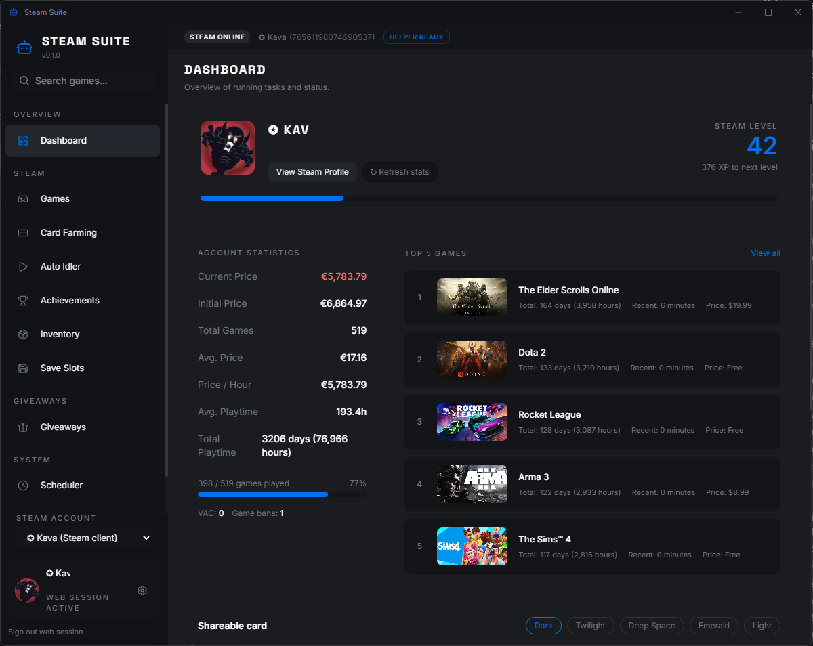
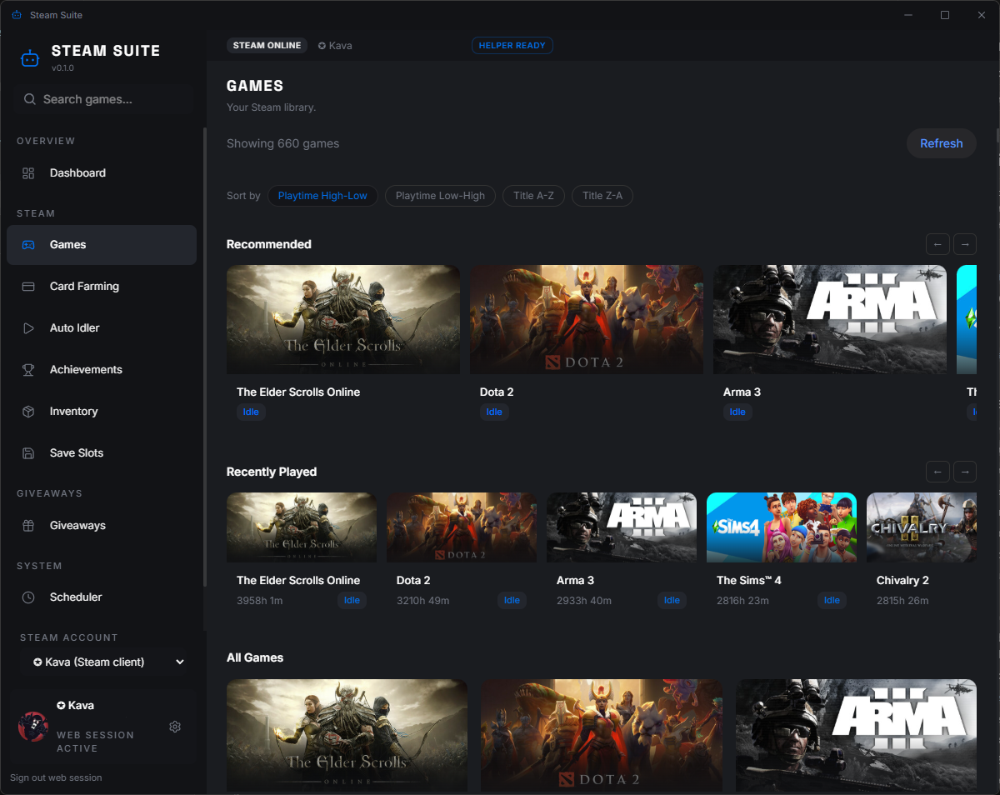
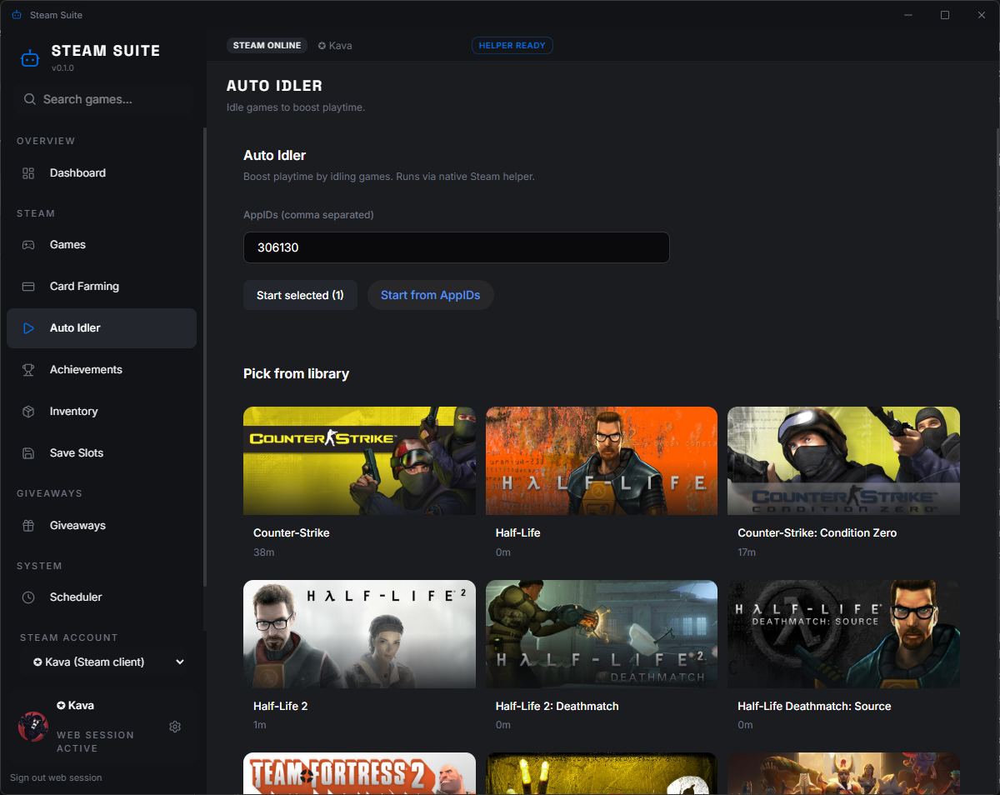
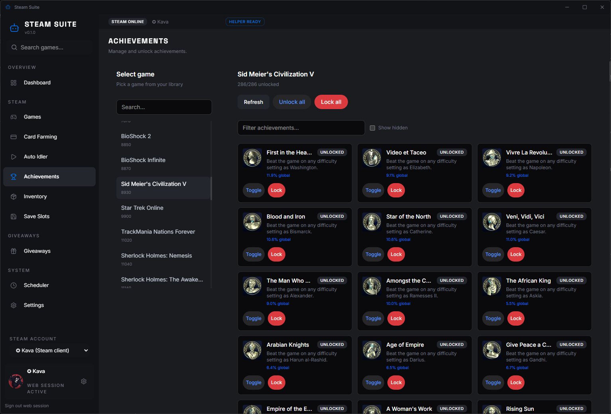
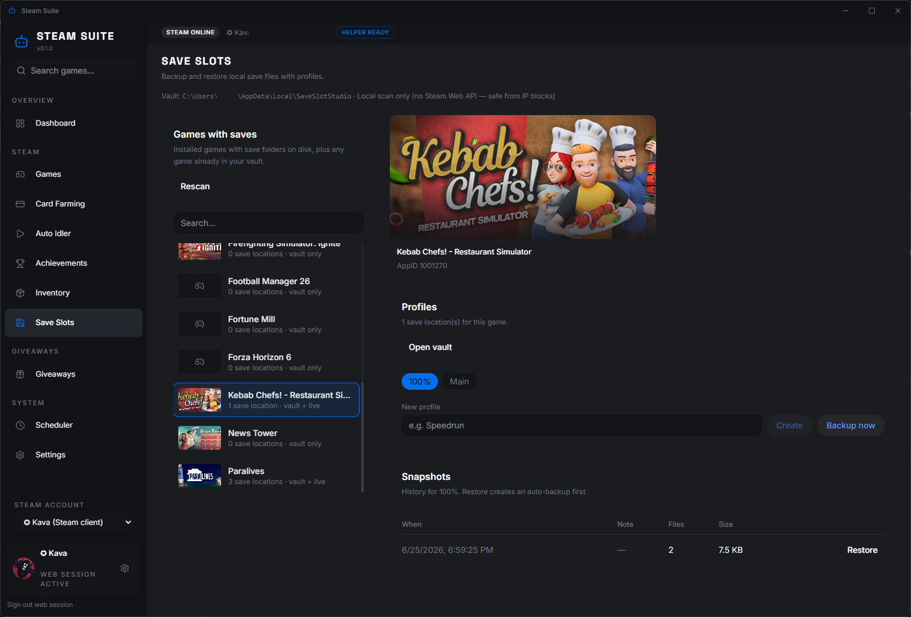

<div align="center">


# Steam Suite

[](https://github.com/Kava-4/steam-suite/releases)
[](LICENSE)
[](https://github.com/Kava-4/steam-suite/releases)
[](https://kava-4.github.io/steam-suite/)

</div>

<h4 align="center">All-in-one Windows desktop app for Steam library management, automation, save backups, and giveaways — in a single portable executable.</h4>

**🚨 IMPORTANT: DOWNLOAD ONLY FROM THIS REPOSITORY. 🚨**  
There are no official YouTube tutorials or third-party mirrors for Steam Suite. If you downloaded an `.exe` from a random video link or file host, treat it as untrusted. The only official source is [github.com/Kava-4/steam-suite](https://github.com/Kava-4/steam-suite) and its [Releases](https://github.com/Kava-4/steam-suite/releases) page.

## 👾 Is it safe to use?

Steam Suite is **open source** — you can audit every line. The app talks to your **local Steam client** (registry, VDF files, bundled native helpers). Most features work offline or with minimal network use. Built-in rate limits help avoid aggressive Store requests.

Use any Steam automation tool at your own discretion. Valve’s terms apply to your account.

## 💫 What can it do?

✅ **Dashboard** — profile stats, library value, top games, shareable card  
✅ **Games** — library grid loaded from local Steam data  
✅ **Auto Idler** — boost playtime on selected titles  
✅ **Card Farming** — manual, rate-limited card scans  
✅ **Achievements** — unlock, lock, and bulk actions per game  
✅ **Inventory** — browse items and open Market listings  
✅ **Save Slots** — profiles, snapshots, restore with auto-backup  
✅ **Giveaways** — SteamGifts entry, win notifications, key redeem  
✅ **Scheduler** — chain farm → idle → giveaways → redeem  
✅ **Multi-account** — per-profile settings and quick switcher  

Native helpers ship **inside** the release binary. On first launch they extract once to:

`%LOCALAPPDATA%\steam-suite\native-libs\`

## 👀 How to use

1. Open the [Releases](https://github.com/Kava-4/steam-suite/releases) page.
2. Download **`Steam-Suite.exe`** (portable) or the NSIS installer.
3. Keep the **Steam client running** and signed in.
4. Launch Steam Suite and pick a module from the sidebar.

> Source archives are for developers who build locally. They are not prebuilt binaries.

## 🛡️ Safe usage (avoid IP blocks)

1. **Games → Refresh** loads your library from the local helper — not a bulk Store scan on startup.
2. **Card Farming → Scan** processes at most 20 games per click with delays between requests.
3. **Save Slots** discovers saves on disk only — no Web API calls for backup or restore.
4. Review **Settings → Steam API protection** before Store-heavy actions.
5. Do not spam Refresh or Scan across tabs.

## 🛠️ Build from source

### Requirements

- **Windows 10/11** (64-bit)
- **Node.js 20+** and **pnpm**
- **Rust** ([rustup](https://rustup.rs/))
- **.NET SDK** (8.x for SaveSlot CLI publish, Framework 4.8 for native helper)
- **Steam client** installed (for runtime testing)

### Dev mode

```powershell
pnpm install
$env:Path = "$env:USERPROFILE\.cargo\bin;" + $env:Path
pnpm td
```

Place built helpers in `libs/` for dev, or run the release script below.

### Release (single portable EXE)

```powershell
# Optional: path to SaveSlot CLI sources if not auto-detected
$env:SAVESLOT_STUDIO_ROOT = "C:\path\to\SaveSlot-Studio"
pnpm release
```

Outputs **`dist/Steam-Suite.exe`** (~85 MB) with helpers embedded. See [libs/README.md](libs/README.md) for helper layout.

### GitHub Pages (website)

Landing page: [`docs/index.html`](docs/index.html) → **Settings → Pages → `/docs`** → [kava-4.github.io/steam-suite](https://kava-4.github.io/steam-suite/)

## ❓ Q&A

- **Does it need a separate `libs/` folder after install?**  
  No. Release builds embed helpers; first run extracts them to AppData.

- **Why is the EXE large?**  
  It includes the UI, Rust runtime, native Steam helper, and self-contained SaveSlot CLI.

- **Can I use multiple Steam accounts?**  
  Yes. Each profile keeps its own idle lists, farm lists, cookies, and region.

- **Save Slots shows “vault only” games**  
  Games registered in your vault appear even when uninstalled. Live saves require the game on disk.

- **Dashboard stats look incomplete**  
  Add an optional Steam Web API key in Settings for enrichment fallback.

---

## 🖼️ Screenshots



<div align="center">

| Games | Auto Idler |
|:---:|:---:|
|  |  |

| Achievements | Save Slots |
|:---:|:---:|
|  |  |

</div>

---

## 📁 Project structure

```
src/              React UI (HeroUI, Tailwind)
src-tauri/        Rust backend + Tauri shell
tools/            Native helper sources (build → libs/)
libs/             Dev-time helpers (gitignored binaries)
docs/             GitHub Pages site + screenshots
scripts/          Release build automation
```

## 📜 License

MIT — see [LICENSE](LICENSE). Copyright © 2026 Kava-4.

---

> **Legal disclaimer**  
> Steam Suite is an independent third-party tool for local library management and automation. It is not affiliated with, endorsed by, or sponsored by Valve Corporation. Use responsibly and in accordance with Steam’s Subscriber Agreement.
